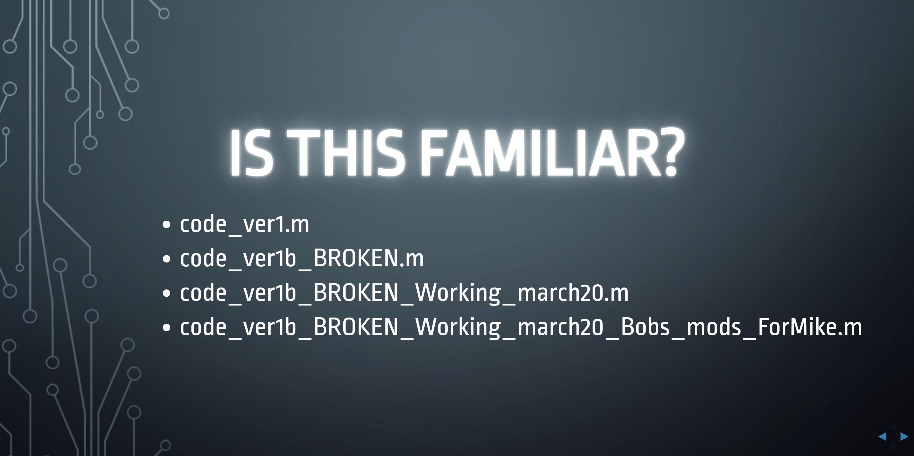

# Bobs code

A trivial GitHub repository to show how life is better when you embrace version control.  Inspired by a slide from my talk '[Is your research software correct](https://mikecroucher.github.io/NAG_IYRSC/)'

## Running the simulation 

In MATLAB, navigate to this directory and type the command 

`simulation` 

The magic will happen!
